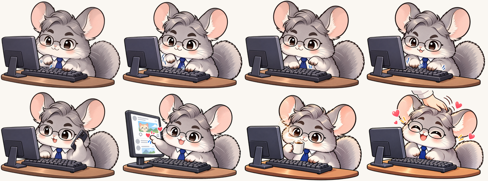

# 🐭 친칠라잼 데스크톱 컴패니언

> 고된 일, 친칠라잼 보면서 조금은 덜 고되기를.

타이핑하면 같이 타닥타닥 키보드를 두드려 주는 작은 친칠라입니다.
한글 · Word · Excel · PowerPoint 등 어떤 프로그램을 쓰든 화면 한쪽에 떠서 함께 일해 줍니다(초기에는 화면 보는 사람 기준 우측 아래에 뜹니다.).
배경은 투명해서 뒤에 있는 작업 화면을 가리지 않도록 만들었습니다.

*A tiny chinchilla desktop companion for Windows that types along with you.*

<p align="center"></p>

## 다운로드

**[👉 최신 버전 내려받기 (Releases)](../../releases/latest)**

`ChinChillaJam-Desktop-Companion-v1.0.0-win-x64.zip`을 받아 압축을 풀고
`친칠라잼 데스크톱 컴패니언.exe`를 더블클릭하면 끝이에요. 설치는 필요 없어요.

| | |
|---|---|
| 지원 OS | **Windows 10 / 11 (64비트) 전용** · macOS·Linux는 지원하지 않아요 |
| 설치 | 필요 없음 (실행 파일 하나) |
| 인터넷 | 사용하지 않음 |
| 크기 | 약 7.7MB |

## 이렇게 반응해요

<p align="center"></p>

| 상황 | 친칠라잼 |
|---|---|
| 타이핑 | 왼발 → 오른발 번갈아 타닥타닥 |
| 빠르게 타이핑 (초당 6타 이상) | 양발로 신나게 |
| 10타마다 | 잠깐 전화 받기 📞 |
| 다른 곳 클릭 | SNS 하트 누르기 + "뾰롱!" 💗 |
| 친칠라 클릭 | 쓰담쓰담 + "뽀용!" + 푸딩처럼 말랑 출렁 🍮 |
| 10초 동안 입력 없음 | 커피 한 잔 ☕ |

## 사용법

- **쓰다듬기**: 친칠라 위에 커서를 올리면 손 모양으로 바뀌어요. 그대로 클릭!
- **옮기기**: 친칠라를 누른 채로 끌어서 원하는 곳에 두세요.
- **메뉴**: 친칠라를 우클릭하면 메뉴가 열려요.
  - **크기 조절**: 커서가 십자 화살표로 바뀌면 친칠라를 누른 채로 바깥쪽으로 끌면 커지고, 중앙 쪽으로 끌면 작아져요. 크기 조절 중에 우클릭하면 취소돼요.
  - **종료**: 프로그램을 완전히 종료해요.
- 화면 밖으로 사라졌다면 작업 표시줄 오른쪽 **트레이 아이콘**을 눌러도 같은 메뉴가 나와요.
- 위치와 크기는 기억해 두었다가 다음 실행 때 그대로 열려요.

## 처음 실행할 때 경고가 뜬다면

코드 서명을 하지 않은 개인 제작 프로그램이라 Windows SmartScreen이
**"Windows의 PC 보호"** 창을 띄울 수 있어요.
**추가 정보 → 실행**을 누르면 실행돼요.

내려받은 파일이 원본 그대로인지 확인하고 싶다면 Releases 페이지에 적힌 SHA-256 값과 비교해 보세요.

```powershell
Get-FileHash .\ChinChillaJam-Desktop-Companion-v1.0.0-win-x64.zip -Algorithm SHA256
```

## 개인정보 · 안전

- 친칠라가 타이핑에 반응하려면 **"키가 눌렸다"는 신호**가 필요해서 Windows 전역 키보드·마우스 훅을 사용해요.
- **어떤 키를 눌렀는지는 읽지도, 저장하지도, 전송하지도 않아요.** 인터넷 통신 기능 자체가 없어요.
- 저장하는 건 창 위치와 크기뿐이에요 (`%APPDATA%\ChinChillaJam\settings.json`).
- 일부 백신이 키보드 훅 때문에 오진할 수 있어요. 소스 코드는 [`app/`](app/) 폴더에 모두 공개되어 있어요.

## 삭제

`.exe` 파일을 지우면 끝이에요. 설정까지 지우려면 `%APPDATA%\ChinChillaJam` 폴더도 삭제하세요.

## 직접 빌드하기

Go 1.21 이상이 필요해요. 외부 라이브러리는 쓰지 않아요.

```bash
cd app
go test ./...
GOOS=windows GOARCH=amd64 go build -trimpath -ldflags "-H windowsgui -s -w" -o "친칠라잼 데스크톱 컴패니언.exe" .
```

PowerShell에서는:

```powershell
cd app
$env:GOOS="windows"; $env:GOARCH="amd64"
go build -trimpath -ldflags "-H windowsgui -s -w" -o "친칠라잼 데스크톱 컴패니언.exe" .
```

아이콘이나 프로그램 이름을 바꿨다면 `python tools/mksyso.py icon rsrc_windows_amd64.syso`로 리소스를 다시 만드세요.

## 폴더 구성

```
app/                 Windows 프로그램 소스 (Go + Win32 API)
```

## 마지막 -  왜 이렇게 만들었는지 등.

- Go언어 기반으로 만든 이유: 처음엔 C# + WPF로 구상했습니다만, '.exe'를 만들 때 작업 환경에서 .NET SDK 다운로드가 막혀 있었습니다. 대신 설치돼 있던 Go로 바꾸어 진행하게 되었습니다. Go는 리눅스에서도 Windows exe를 바로 만들 수 있고, 런타임 설치가 필요 없는 단일 파일이 나온다는 이점이 있구요, "설치 없이 더블클릭"이라는 배포 조건에 오히려 더 잘 맞아서 Go 언어 기반으로 만들었습니다.
- Python 을 쓴 이유: 그 환경에 아이콘 리소스를 만드는 도구가 없어서, 그냥 가장 빨리 짤 수 있는 Python으로 생성기를 직접 만들었습니다. 솔직히 편의상 고른 거지, 꼭 Python이어야 할 이유는 없었다는 것이 사실입니다.
- HTML 을 쓴 이유: '.exe'를 만들기 전에 동작 규칙을 빨리 확인하려고 만든 시험용 페이지입니다. 지금은 데모 용도만 남아 있을겁니다.

- 사족: 유지보수 관점에서는 언어를 통일하는 것이 편의성 등의 이점을 가진다는 사실을 모르지 않습니다. 가장 손이 덜 가는 방법은 Python 생성기를 Go로 옮기는 것이고, 150줄 정도라 금방 옮길 수 있는데 그렇게 수정한다면:
  - 빌드에 필요한 건 Go 하나뿐 (go run ./tools/mksyso → go build)
  - preview.html은 프로그램과 상관없는 데모 문서라서 남겨도 되고 빼도 됨.
  - 나중에 Android 버전(이렇게 된다면 태블릿 pc 에서도 사용이 가능할 거 같습니다.)을 만들 때는 Kotlin을 쓰게 될 성 싶습니다. 그때 Windows 쪽만 Go로 남는 게 신경 쓰이면 Windows 버전을 C#으로 다시 짜는 선택지도 있긴 하구요. 다만 이건 거의 처음부터 다시 만드는 일이라, 지금 잘 돌아가는 Go 버전을 두고 당장 할 만큼의 이득은 없다고 봐서 이렇게 구현했습니다.
 
- 추후 방향: Python 생성기를 Go로 옮겨서 다음 버전(v1.0.1)에 넣을 수 있게 정리하거나('.exe' 동작은 똑같고 빌드 방법만 단순해지는 루트), 아예 태블릿 용 앱 호환도 되도록 C#으로 다시 짜는 두 가지 방안 중에서 하나 골라서 진행할 예정입니다.
